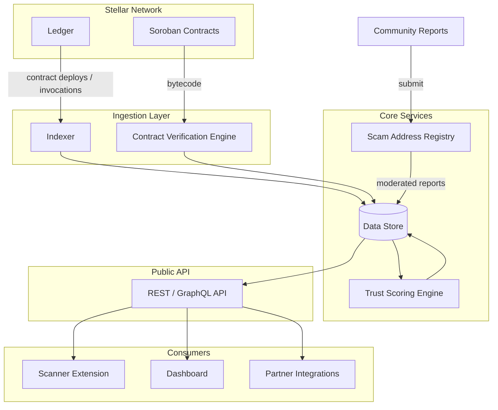

# Backend

Indexing, contract verification, and real-time trust scoring for the Stellar ecosystem — the engine behind a community-driven scam address registry and the public API that powers the scanner extension, dashboard, and partner integrations.

> **Status: pre-implementation.** This repo currently holds the project vision only — no code has been written yet. Sections below describe the intended design and will be updated as implementation lands.

## Overview

Backend is the server-side system that makes it possible to answer "is this Stellar address or contract safe?" in real time. It watches the Stellar ledger as contracts are deployed and invoked, verifies deployed Soroban contract code against submitted source, and combines that with a community-maintained scam address registry to compute a trust score for any address or contract. That data is exposed through a public API consumed by a browser scanner extension, a web dashboard, and partner integrations.

## Features

- **On-Chain Indexers**: Continuously ingest Stellar ledger activity — contract deployments, invocations, and token transfers — into a queryable store
- **Contract Verification Engine**: Matches deployed Soroban WASM bytecode against submitted source, marking contracts as verified/unverified
- **Real-Time Trust Scoring**: Computes a risk/trust score per address or contract from on-chain signals and registry data, updated as new activity arrives
- **Community Scam Address Registry**: Crowdsourced reporting of malicious addresses and contracts, with moderation before a report affects trust scores
- **Public API**: Serves scanner extension lookups, dashboard views, and partner integrations from a single source of truth

## Architecture (planned)

### Core Components (planned)

- **Indexer**: Subscribes to Stellar Horizon / Soroban RPC, ingests contract deployments, invocations, and transfers
- **Contract Verification Engine**: Compares deployed WASM against submitted source to mark contracts verified/unverified
- **Trust Scoring Engine**: Recomputes a per-address/contract trust score as new indexed activity or registry reports arrive
- **Scam Address Registry**: Stores community-submitted reports and their moderation status
- **Public API**: Exposes lookup, scoring, and registry endpoints to the extension, dashboard, and partners

## Tech Stack (proposed)

| Component            | Technology                     | Purpose                                                        |
|-----------------------|---------------------------------|-----------------------------------------------------------------|
| Runtime               | Node.js + TypeScript            | Indexer, scoring engine, and API implementation                 |
| Blockchain            | Stellar / Soroban                | Source of ledger and contract data being indexed and verified   |
| API                   | REST or GraphQL (TBD)           | Serves scanner extension, dashboard, and partner consumers      |
| Data Store            | TBD                              | Persists indexed activity, verification results, and registry   |

Exact framework, database, and hosting choices are not yet finalized and will be filled in as the implementation starts.

## Trust Score Inputs (planned)

| Signal                        | Source                        |
|--------------------------------|--------------------------------|
| Contract verification status   | Contract Verification Engine   |
| Address/contract age & activity| Indexer                        |
| Community scam reports         | Scam Address Registry          |
| Holder / interaction patterns  | Indexer                        |

Exact weighting and scoring formula are not yet defined.

## Consumers

- **Scanner Extension**: Browser extension that looks up trust scores for addresses/contracts a user encounters
- **Dashboard**: Web UI for browsing indexed contracts, verification status, and registry reports
- **Partner Integrations**: Third-party services querying the public API for scam/trust data

## Roadmap

- [ ] Define data store and API technology choices
- [ ] Stand up Stellar ledger indexer
- [ ] Build contract verification engine (source-to-WASM matching)
- [ ] Implement community scam address registry with moderation flow
- [ ] Implement trust scoring engine
- [ ] Ship public API (v1)
- [ ] Integrate with scanner extension and dashboard

## Contributing

This project is in the design phase. If you'd like to help shape the architecture or contribute once implementation starts, open an issue to discuss.

## License

TBD
