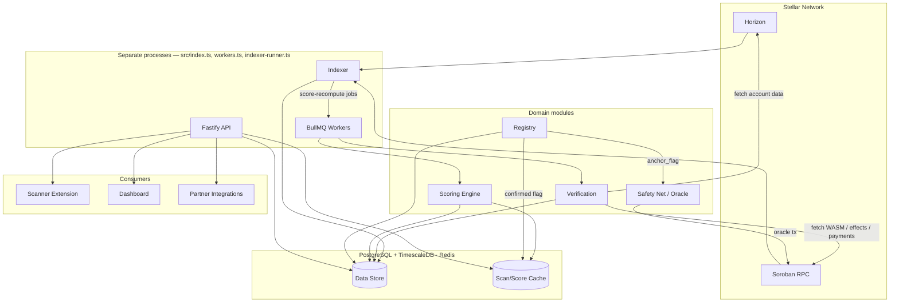

# Astraguard Backend

Indexing, contract verification, and real-time trust scoring for the Stellar ecosystem — the engine behind a community-driven scam address registry and the public API that powers the scanner extension, dashboard, and partner integrations.

Full system design lives in [ARCHITECTURE.md](ARCHITECTURE.md). This repo is `astraguard-backend`, one of three: [`astraguard-frontend`](ARCHITECTURE.md#4-astraguard-frontend--the-face) and [`astraguard-contracts`](ARCHITECTURE.md#3-astraguard-contracts--the-trustless-layer) are separate repos, and neither exists yet — this backend's oracle/contract calls no-op with a warning until `astraguard-contracts` is deployed and its contract IDs are configured (see [Known limitations](#known-limitations)).

## Overview

Astraguard answers "is this Stellar address or contract safe?" in real time. It watches the Stellar ledger as contracts are deployed and invoked, runs automated verification checks against deployed Soroban contracts, and combines that with a community-maintained scam address registry to compute a trust score for any address or contract. That data is served through a public API consumed by a browser scanner extension, a web dashboard, and partner integrations.

## Features

- **On-Chain Indexers**: Stream Stellar Horizon payments and poll Soroban contract events, feeding score recomputation as new activity arrives
- **Verification Engine**: Fetches real deployed Soroban WASM and inspects it structurally (exports, imports, contract spec) for known-risk and privileged function names; runs behavioral monitors (liquidity drain, signer-churn admin-key-abuse, circular-payment wash-trading, auth-revocable/clawback honeypot pattern) against real Horizon data; checks reserve ratios; persists KYC submissions and analyst decisions
- **Trust Scoring**: A weighted-sum v1 score (see [Trust score signals](#trust-score-signals)) computed from real verification results, registry status, and account age — not hardcoded placeholders
- **Community Scam Registry**: Report intake with a two-person confirmation rule (one analyst endorses, a different analyst confirms) before a flag goes live; confirmed flags propagate to the scan cache and anchor on-chain via the oracle
- **Public API**: Fastify-based REST API with per-key-tier rate limiting, CORS, and audit logging — scores, pre-transaction scan, registry, certification (incl. KYC), claims, and signed partner webhooks

## Architecture



### Module layout

```
src/
├── api/          # Fastify app, routes, auth/rate-limit/audit middleware, openapi.yaml
├── indexer/      # Horizon stream, Soroban poller, backfill, account-age lookup
├── verification/ # static/, behavioral/, reserves/, kyc/ checks
├── scoring/      # signal weights, engine, history, thresholds
├── registry/     # report intake, two-person review, propagation
├── safetynet/    # claims, fund tracing, exchange alerts, oracle contract calls
└── shared/       # config, logger, db, redis, queue, stellar clients, errors
```

## Tech Stack

| Component      | Technology                                    |
|----------------|------------------------------------------------|
| Runtime        | Node.js 20+, TypeScript (strict), Fastify 5    |
| Data store     | PostgreSQL + TimescaleDB (`score_history` hypertable) |
| Cache / queue  | Redis, BullMQ                                  |
| Blockchain     | `@stellar/stellar-sdk` (Horizon + Soroban RPC) |
| Validation     | Zod                                            |
| Testing        | Vitest (unit + integration against live Postgres/Redis) |

## Trust score signals

`src/scoring/signals.ts` — a v1, auditable weighted sum (**not calibrated against real scam-vs-legitimate outcome data yet**):

| Signal              | Weight | Source                                                        |
|----------------------|--------|----------------------------------------------------------------|
| Registry flags       | 0.25   | Confirmed community scam reports (registry two-person rule)   |
| Contract verified    | 0.20   | Static analysis outcome (real fetched WASM)                   |
| Reserve ratio        | 0.20   | Attested reserves vs. issued supply                            |
| KYC status           | 0.15   | Team identity verification decision                            |
| Liquidity stability  | 0.10   | Behavioral monitor: liquidity drain check                      |
| Account age          | 0.10   | Cached Horizon account first-seen date                         |

A subject with no data for a given signal gets a neutral prior (50/100), not a penalty.

## Getting started

```bash
cp .env.example .env
docker compose up -d          # Postgres (TimescaleDB) + Redis
npm install
npm run migrate               # apply all migrations
npm run seed                  # creates an admin user + prints an API key (shown once)
npm run dev                   # API server on :4000
```

In separate terminals, as needed:

```bash
npm run workers                # processes score-recompute, registry-propagation, alert-dispatch, claim-tracing queues
npm run indexer                # Horizon stream + Soroban poller (requires contract IDs configured to poll Soroban events)
```

## Testing

```bash
npm test                # unit tests — no infra required
npm run test:integration # exercises the real HTTP layer against live Postgres/Redis (docker compose up -d first)
npm run test:all         # both
```

CI (`.github/workflows/backend-ci.yml`) runs lint, typecheck, migrations, both test suites, and the build against Postgres/Redis service containers on every push/PR.

## Known limitations

- **`astraguard-contracts` doesn't exist yet.** `REGISTRY_ANCHOR_CONTRACT_ID` / `INSURANCE_POOL_CONTRACT_ID` are unset by default, so oracle calls (`safetynet/oracle.ts`) log a warning and return a no-op tx hash instead of failing.
- **Scoring weights and thresholds are provisional** (`scoring/signals.ts`, `scoring/thresholds.ts`) — not calibrated against labeled outcomes.
- **Behavioral/static checks are real but heuristic**, not a substitute for a manual audit — see the `details` field each check returns for exactly what was and wasn't inspected.
- **No KYC provider integrated** — `KYC_PROVIDER_API_KEY` routes to manual analyst review only.
- **Oracle key is loaded from env** (`ORACLE_SECRET_KEY`) for dev/testnet. Production requires swapping `shared/stellar.ts#loadOracleKeypair` for a KMS/HSM-backed signer per `ARCHITECTURE.md` §2.4.
- **No admin/self-serve key issuance endpoint** — `npm run seed` is the only bootstrap path, matching the internally-provisioned-analyst model in `ARCHITECTURE.md`.

## License

TBD
